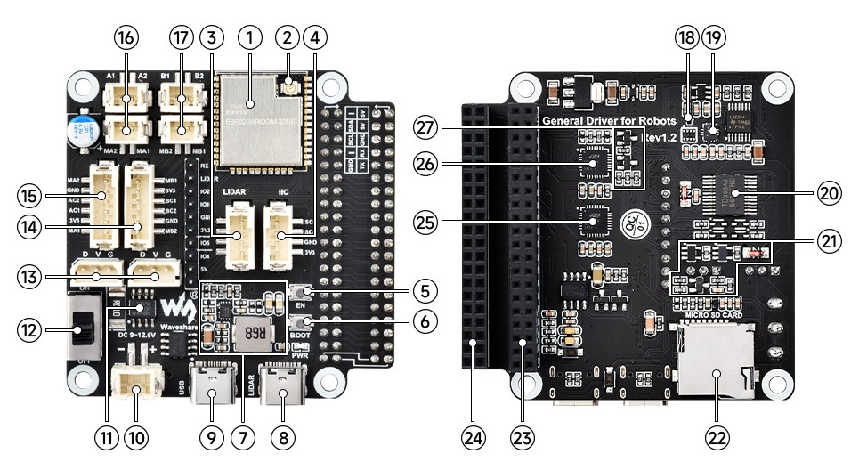

# Driver board

## Summmary

Out of the box you'll find a chassis, with wheels/tracks and motors. A realtime controller based on an ESP32 is in the box as well. Sensors are build in for temperature and voltage control. Space for batteries and a 5V UPS like device is built in the chasssis. Power is used for the ESP, the motors and other (optional) components. 

Some connectors from the driver board are fed outside the chassis. These connectos are available to the host controller, e.g. a Raspberry PI.
Avaible:
  * 5V
  * GND
  * TX (hint don't forget to connect TX from driverboard to RX from Raspberry and other way round)
  * RX
  * SCL
  * SDA

## Driver board

 The UGV comes with a driver board, see picture below:

 

|No.|Onboard Resources                                                    |
|--:|:--------------------------------------------------------------------|
|  1|ESP32-WROOM-32 main controller                                       |
|  2|IPEX1 WiFi connectoR                                                 |
|  3|LIDAR interface OPTIONAL Integrated radar adapter board function     |
|  4|IIC peripheral expansion interface	                                  |
|  5|Reset button	                                                      |
|  6|Download button	                                                  |
|  7|DC-DC 5V voltage regulator circuit	for host computers                |
|  8|Type-C connector (LIDAR)	LIDAR data interface                      |
|  9|Type-C connector (USB)	ESP32 UART communication interface            |
| 10|XH2.54 power port	Input DC 7~13V, Serial bus servo and motor        |
| 11|[INA219](https://github.com/wollewald/INA219_WE) Voltage/current monitoring chip                               |
| 12|Power ON/OFF	                                                      |
| 13|ST3215 serial bus servo interface	                                  |
| 14|Motor interface PH2.0 6P Group B interface for motor with encoder    |
| 15|Motor interface PH2.0 6P Group A interface for motor with encoder    |
| 16|Motor interface PH2.0 2P Group A interface for motor without encoder |
| 17|Motor interface PH2.0 2P Group B interface for motor without encoder |
| 18|AK09918C 3-axis electronic compass                                   |
| 19|QMI8658 6-axis motion sensor                                         |
| 20|TB6612FNG	Motor control chip                                        |
| 21|Serial bus servo control circuit	                                  |
| 22|SD card slot Can be used to store logs or WIFI configurations        |
| 23|40PIN extended header. Easy access to Raspberry Pi                   |
| 24|40PIN extended header.Easy to use the pins of the driver computer    |
| 25|CP2102	UART to USB for radar data transfer                           |
| 26|CP2102	UART to USB for ESP32 UART communication                      |
| 27|Automatic download circuit                                           | 
---

## Software

See [Command set](commandset.md)
