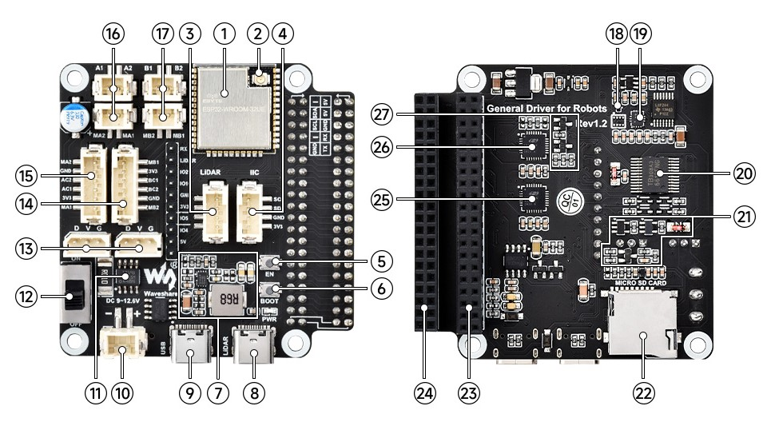

# Technical Architecture

The robot system is technical divided in two main components as described below

##ESP (Microcontroller)
- Motor control (tracks)
- Encoder reading
- Low-level safety logic
- Deterministic real-time behavior

##Raspberry Pi
- AI vision processing
- Autonomous navigation logic
- Sensor fusion
- Mission planning
- User interface / remote control
- Data logging

Any PI will work. We use a Pi Zero for testing purposes. However if you are considering working with AI like features suggest using a PI5.

---

### Hardware
A [WaveShare UGV Tracked Robot](https://www.waveshare.com/wiki/UGV01)
 

  
|No.|Onboard Resources                                                    |
|--:|:--------------------------------------------------------------------|
|  1|ESP32-WROOM-32 main controller                                       |
|  2|IPEX1 WiFi connectoR                                                 |
|  3|LIDAR interface OPTIONAL Integrated radar adapter board function     |
|  4|IIC peripheral expansion interface	                                  |
|  5|Reset button	                                                      |
|  6|Download button	                                                  |
|  7|DC-DC 5V voltage regulator circuit	for host computers                |
|  8|Type-C connector (LIDAR)	LIDAR data interface                      |
|  9|Type-C connector (USB)	ESP32 UART communication interface            |
| 10|XH2.54 power port	Input DC 7~13V, Serial bus servo and motor        |
| 11|[INA219](https://github.com/wollewald/INA219_WE) Voltage/current monitoring chip                               |
| 12|Power ON/OFF	                                                      |
| 13|ST3215 serial bus servo interface	                                  |
| 14|Motor interface PH2.0 6P Group B interface for motor with encoder    |
| 15|Motor interface PH2.0 6P Group A interface for motor with encoder    |
| 16|Motor interface PH2.0 2P Group A interface for motor without encoder |
| 17|Motor interface PH2.0 2P Group B interface for motor without encoder |
| 18|AK09918C 3-axis electronic compass                                   |
| 19|QMI8658 6-axis motion sensor                                         |
| 20|TB6612FNG	Motor control chip                                        |
| 21|Serial bus servo control circuit	                                  |
| 22|SD card slot Can be used to store logs or WIFI configurations        |
| 23|40PIN extended header. Easy access to Raspberry Pi                   |
| 24|40PIN extended header.Easy to use the pins of the driver computer    |
| 25|CP2102	UART to USB for radar data transfer                           |
| 26|CP2102	UART to USB for ESP32 UART communication                      |
| 27|Automatic download circuit                                           | 
---

### PI Shutdown circuit

If you hit the power button, the ESP will loose power directly. Since the microcontoller is stateless that is OK. 
For the Raspberry thats different. This Linux machine wants to be shutdown correctly to prevent data loss issues
on the memory card. The below shutdown circuit feeds GPIO4 with a logical True. When the ESP drops power, GPIO4 will
go to False, which is a signal for the PI to inmmediatelu go into shutdown. The supercaps will give the PI some
time to complete that task.

## Software for the shutdown circuit

To be described

something in crontab on shutdown

stop boss gracefull

shutdown

Step 1:  To write our software, open Thonny IDE or any other Python IDE of your choosing. Copy and paste the code below (to see what’s going on, read the comments). 

Once you’ve finished, save the application to a file of your choice.

#Made for 

Import RPI.GPIO as GPIO
#Import to read state of GPIO Pin
import os
#Import to execute sudo shutdown command
import time
#Import for sleep function, gives the user time to plug the cable back in
GPIO.setmode(GPIO.BCM)
#Uses BCM pin numbering (i.e., the GPIO number, not the pin number)
GPIO.setup(4, GPIO.IN)
#Setup to receive input from GPIO pin #4 as HIGH(1) or LOW(0)
while True:
if GPIO.input(4) == 0: #0==Low, if it detects cable is pulled
time.sleep(9) #Sleep for 9 seconds, allows user to plug the cable back in in the allotted time,
#change as needed for up to 30 seconds
If GPIO.input(4) == 1: #If after 9 seconds, user plugs cable back in and GPIO 4 reads
#HIGH passes
Pass
else:
os.system(“sudo shutdown -h now”) #If cable not plugged back in, execute shutdown #command
if GPIO.input(4) == 1:
Pass

Step 2: Now, we want the program to execute every time the Raspberry Pi is turned on. To do so, simply open a command prompt and enter the following command: “sudo nano /etc/rc.local”

 

Now scroll down to the bottom of the file and add “python” and your file location immediately before the line “exit 0.” “python /home/pi/supercap shutdown.py” was the command in my instance.

